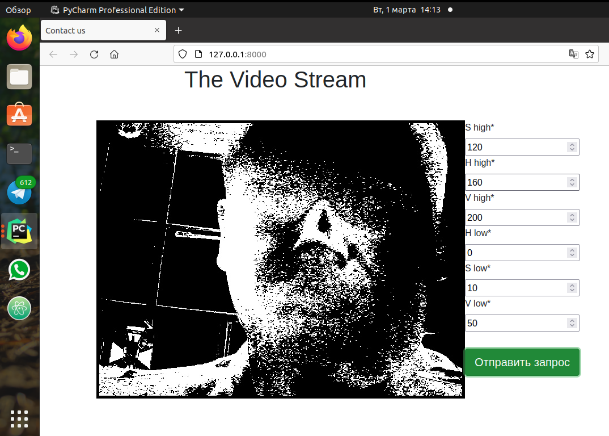

# Django Video Stream

---
This project demonstrates Video Stream from webcam to the HTML-template 
through Django-server using OpenCV, Ajax and JQuery
---
### Work

1. Install Packets and Dependencies
2. Run server:
```bash
python manage.py runserver
```
3. Go to  http://127.0.0.1:8000/
4. Enjoy 




Sources:  
https://docs.djangoproject.com  
https://django-crispy-forms.readthedocs.io  
https://pythonru.com/primery/django-ajax  

